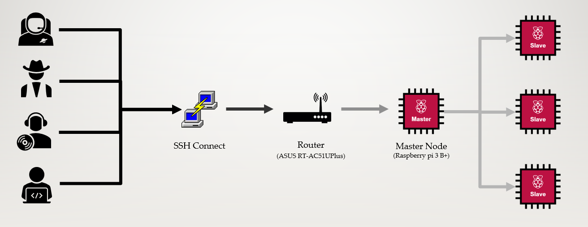

# 1. Base Knowledge

Outline
1. Cluster Structure
2. Algorithm
3. Message Passing Interface

## 1. Cluster Structure
### 병렬 클러스터
- 비선형적인 연산을 더 빠르게 수행하기 위해 서로 다른 CPU를 통신을 통해 묶어둔 것.
  - 비선형적인 연산: 서로 연결성이 없는 연산(명령어)을 의미한다. 
    ```text
    선형적인 연산: 두 연산 사이에 A라는 매개체가 존재한다.
    A = A + B;
    C = A + 1;

    비선형적인 연산: 두 연산 사이에 연결성이 없음
    A = A + B;
    C = C + D;

    tip.
    선형적인 연산의 경우, 수행 순서를 바꾸면 기존 수행 결과와 서로 다른 결과가 나온다.
    비선형적인 연산의 경우, 서로 수행 순서를 바꿔도 동일한 결과가 나온다.
    ```

### 클러스터 구조
- 일반적으로 마스터 노드 하나와 여러개의 슬래이브 노드로 구성된다
- 마스터 노드는 슬래이브 노드에 public SSH key를 배포해줘 이후 추가적인 작업 없이 슬래이브 노드에 접속할 수 있도록 설정해줘야한다. [여기를 참조](https://opentutorials.org/module/432/3742)
- 사용자는 SSH 통신을 통해 마스터 노드 및 슬래이브 노드로 접속할 수 있다.(일반적으로 Putty를 사용)
- 각각의 슬래이브 노드는 할당받은 작업을 수행한 후 데이터를 마스터 노드에 전송한다.
- 마스터 노드는 전송된 데이터를 취합한 후 사용자에게 보여주거나 추가적인 작업을 수행한다.
    

## 2. Algorithm
### Rank
- Rank: 분할된 작업이라고 생각하자.
  - 1부터 100까지의 수를 모두 다 더하는 작업을 5개의 랭크로 나눈다고 가정해보자.
    ```text
    1 + 2 + 3 + 4 + 5 + .... + 99 + 100 = ?
    ->  1 +  2 +  3 +  4 +  5 + .... + 19 +  20 = Rank A
    -> 21 + 22 + 23 + 24 + 25 + .... + 39 +  40 = Rank B
    -> 41 + 42 + 43 + 44 + 45 + .... + 59 +  60 = Rank C
    -> 61 + 62 + 63 + 64 + 65 + .... + 79 +  80 = Rank D
    -> 81 + 82 + 83 + 84 + 85 + .... + 99 + 100 = Rank E

    1 + 2 + 3 + 4 + 5 + .... + 99 + 100 = A + B + C + D + E = 210 + 610 + 1010 + 1410 + 1810 = 5050
    ```
  - 서로 다른 랭크는 연산이 모두 병렬척으로 처리가 되기 때문에 일반적인 연산보다 훨씬 빠른 속도로 연산을 처리할 수 있다.
### 작업의 분할 및 Rank의 분배
- 일반적으로 작업을 여러개의 랭크로 분할하고 노드별로 분할해주는 것은 마스터 노드의 역할이다.
- 보드 별로 할당받을 수 있는 최적의 랭크 개수는 다르며, 강제성이 없을 경우 라즈베리파이의 경우 최대 4개, 오드로이드의 경우 최대 8개의 랭크를 할당받는다.
- Rank 0는 반드시 마스터 노드에 존재하며, 데이터 전송 및 데이터를 받아오는 역할을 한다.
    ```text
    Rank 0-----> 마스터 노드에 할당
    Rank 1 |
    Rank 2 |
    Rank 3--
    Rank 4-----> 슬래이브 노드 A에 할당
    Rank 5 |
    Rank 6 |
    Rank 7--
    Rank 8-----> 슬래이브 노드 B에 할당
    Rank 9  |
    Rank 10 |
    Rank 11--
    Rank 12----> 슬래이브 노드 C에 할당
    Rank 13 |
    Rank 14 |
    Rank 15--
    ```

### Rank의 수행
- 분할받은 랭크는 보드 내에서 거의 동시에 처리된다.
  - 대부분의 보드는 멀티프로세서가 지원된다는 점을 잊지 말자.
  - 랭크 0는 반드시 제일 마지막에 끝난다.
    ```text
    [   0  ]-----------------------------------------> 전송된 데이터를 취합한 후 이후 작업 수행한다.
    [   1  ]-----> 거의 동시에 수행!------------>|
    [   2  ] |                     데이터 전송   |
    [   3  ]--                                  |
                                                |
    [   4  ]--                                  |
    [   5  ] |---> 거의 동시에 수행!------------>|
    [   6  ] |                     데이터 전송   |
    [   7  ]--                                  |
                                                |
    [   8  ]--                                  |
    [   9  ] |---> 거의 동시에 수행!------------>|
    [  10  ] |                     데이터 전송   |
    [  11  ]--                                  |
                                                |
    [  12  ]--                                  |
    [  13  ] |---> 거의 동시에 수행!------------>|
    [  14  ] |                     데이터 전송   |
    [  15  ]-------------------------------------
    ```

- 이때, 할당된 랭크를 전송받는 시간, 데이터를 읽는 시간 등 하나의 랭크를 수행하기 위해 요구되는 사전 준비 시간 또한 존재한다.
  - 실질적으로 연산을 진행하는 랭크가 5개라고 해도 소요 시간이 5분의 1로 줄어드는 것은 아니다.
    
- 보드 자체에서 동시에 수행할 수 있는 프로세스 개수가 제한되어 있다. 
  - 무작정 랭크의 개수를 늘린다고 해서 수행 속도가 무조건 더 빨라지는 것은 아니다.

## 3. Message Passing Interface
- MPI: 지역적으로(노드) 메모리를 따로 가지는 프로세스(랭크)들이 데이터를 공유하기 위해 메시지를 송신, 수신하여 통신하는 방식을 말한다.
    
  1. 프로세스들은 개별의 메모리를 갖게되며, A라는 프로세스는 B라는 프로세스의 메모리 영역에 접속하지 못한다.    
  2. 이름 그대로 단순히 통신만을 할수 있는 인터페이스이기 때문에 병렬화를 위한 작업 할당, 데이터 분배, 통신의 운용 등 모든 것은 전적으로 프로그래머가 담당한다.
  3. 고려해야하는 상황이 많아서 사용하기 까다롭지만 유연성이 좋다.
  4. **다양한 하드웨어 플랫폼에서 사용할 수 있다.**
     - 난이도는 높은 방법이지만, 그 단점을 보완할 정도로 범용성이 좋다.

### MPI and SSH

### Fortran, C, Python
- MPI 모듈의 가장 최적화가 잘 되어있는 언어는 Fortran과 C이다.
- 단, MPI4PY 헤더를 활용해 파이썬을 활용한 코딩 또한 가능하다.


### MPI 기본 개념들
#### 프로세스와 프로세서(Process and Processor)
- 프로세스(Rank): 수행하려던 작업을 분할한 개수
- 프로세서: 프로세스를 수행하는 소자(보드)
  - 일반적으로 하나의 프로세서에 하나의 프로세스가 할당되는 것이 바람직하다.

#### 메시지(Message)
- 일반적으로 통신을 할때 고려해야하는 것들을 생각해보자.
- 데이터 + 봉투(데이터의 송수신부)
- 데이터 그 자체보단 어떤 데이터의 이동에 초점을 맞춰서 생각한다.
  - 송신 프로세스
  - 송신 프로세스 내에 데이터가 존재하는 위치
  - 데이터 자료형
  - 데이터 크기

  - 수신 프로세스
  - 수신 프로세스 내에 데이터를 저장하는 위치
  - 데이터를 받기 위해 필요한 공간
  - 데이터 송수신 진행 상황

#### 꼬리표(Tag)
- 프로세스간에 서로 주고받는 메시지를 구분하고 확인할 목적으로 붙임
- A라는 프로세스에서 B라는 프로세스로 10개의 메시지를 보낸다고 가정했을때, 이를 태그를 통해 구분한다.

#### 커뮤니케이터(Communicator)
- 통신 가능한 프로세스들의 집합이다. 즉, 서로 다른 커뮤니케이터에 존재하는 프로세스들끼리는 통신할 수 없다.
- 커뮤니케이터의 이름은 점대점 통신과 집합 통신에 인수로 필요하며, 송신하는 프로세서와 수신하는 프로세서가 위치한 커뮤니케이터가 일치해야한다.
- 한 프로그램 내에는 여러 개의 커뮤니케이터가 존재하고, 하나의 프로세스는 여러개의 커뮤니케이터에 존재할 수 있다.
- MPI_COMM_WORLD는 MPI에서 기본적으로 제공하는 커뮤니케이터로 MPI 헤더파일에 정의되어 있으며, 병렬 작업에 참여하는 모든 프로세스들로 구성된다
 
#### 랭크(Rank)
- 분할된 프로세스들 중 동일한 커뮤니케이터에 존재하는 것들을 의미한다.
- 랭크는 0번부터 시작하는 연속된 정수 숫자들을 할당받는데 이는 이후 각각의 랭크를 구분짓는데 사용된다.

#### 통신 모듈
1. 점대점 통신: 한 쌍의 프로세스가 통신을 수행한다. 오직 두 개의 프로세스만이 그 메시지를 알 필요가 있을 때 주로 사용.
    
2. 집합 통신: 한 무리의 프로세스가 동시에 통신에 참여한다.
   - 집합통신 루틴을 호출하는 한 줄의 코드가 여러 번의 점대점 호출을 대신하므로 오류의 가능성이 줄어든다.
   - 코드를 좀 더 쉽게 읽을 수 있어 디버깅 작업 등이 간단해 진다
   - 일대다 통신, 다대일 통신 등이 여기에 해당됨.


