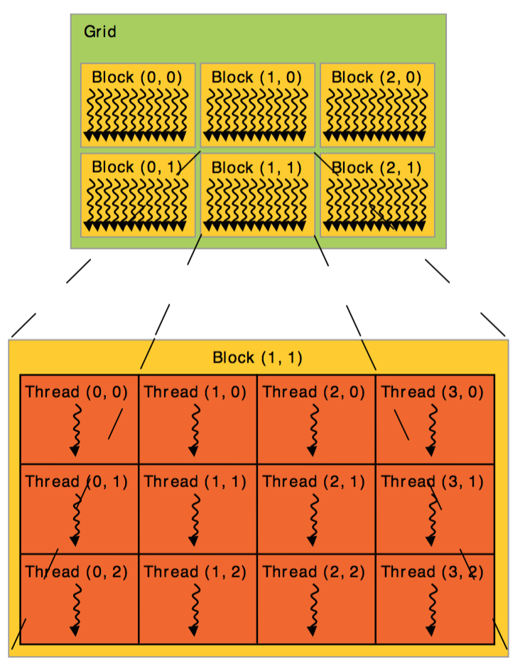

# 1. Base Knowledge
---
---
## Base Knowledge
- Cuda를 효율적으로 사용하기 위해 기본적으로 알고 있어야 하는 정보들을 모아둔 것.
- 상당히 심층적인 정보도 꽤 있으니 알아서 걸러 공부할 것.

### SIMT(Single Instruction Multiple Threads)
- NVDIA에서 CUDA의 작동 원리를 설명하기 위해 CPU에서 사용하는 용어를 차용해 만든 조어
  - CPU 모델 중 하나인 SIMD와 유사하기에 이를 따와 만들었다고 한다.

- Cuda는 여러개의 쓰레드를 하나의 명령어로 동작시킬 수 있다. -> 일반적으로 쓰레드당 하나의 데이터를 처리하는 것을 감안했을때, 동시에 여러 데이터를 처리 가능
  - 이와 같은 병렬적인 처리는 가장 기본적이면서도 중요한 개념이므로, 반드시 숙지하도록 하자. 제대로 이해 안되면 MPI 쪽에서 직접 돌려보면서 이해할 것.

### Kernels
- GPU에서 처리하는 동작을 의미. GPU가 처리해야하는 작업을 짜둔 함수라고 보면 됨.
- 커널의 앞부분에는 항상 키워드가 달리며 키워드에 따라 호출될 수 있는 범위가 달라진다(c++의 private, public 개념이라고 생각하면 됨)
- 커널을 통해 동일한 프로그램에서도 서로 동작하는 하드웨어가 다르도록 개발할 수 있다.
- example
    ```c
    __global__ void VecAdd(float* A, float* B, float* C)
    {
        int i = blockDim.x * blockIdx.x + threadIdx.x;
        C[i] = A[i] + B[i];
    }
    // for GPU

    int main()
    {
    ...
        // Kernel invocation with N threads
        VecAdd<<<M, N>>>(A, B, C);
    ...
    }
    // for CPU
    ```
| 키워드 | 의미 |
|:-----:|:-----|
|globale|CPU Main Thread에서만 호출 가능한 GPU에서 동작하는 함수|
|host|CPU Thread에서만 동작하는 함수|
|device|GPU 커널 함수 내부에서만 호출 가능한 GPU 함수|
|host device|CPU/GPU함수 각각 모두 호출 가능한 함수|

### Thread Hierachy
- SIMT 구조: 여러개의 쓰레드를 동시에 동작
  - 이때, 개발자는 얼마나 많은 쓰레드를 동시에 동작시킬 것인지 지정해줘야한다. -> 개발자는 쓰레드가 어떤 구조로 실행되는지 알아야함



  - 쓰레드가 모여 쓰레드 블록을 형성하고, 블록이 모여 그리드를 형성하는 것을 그림으로 나타낸 것.


#### Thread and Block
- 쓰레드는 쓰레드 블록으로 묶여서 동작한다. 그리고 블록은 다시 그리드라는 단위로 묶여서 동작한다.
- 쓰레드는 하나의 스트리밍 프로세서(Streaming Processor, 코어라고도 함)에서 한 클럭에 이뤄지는 작업이며, 한 사이클을 4 클럭으로 간주한다. 즉, 스트리밍 프로세서에서는 한 사이클에 총 네개의 쓰레드가 연산된다. 일반적으로 스트리밍 프로세서가 8개 모여 스트리밍 멀티프로세서(Streaming Multy Processor)를 구성하며, 이때 스트리밍 멀티 프로세서에서 한 사이클에 수행되는 쓰레드의 개수를 워프(warp)라고 한다. 최종적으로, GPU는 이런 스트리밍 멀티프로세서의 집합체라고 보면 된다.

    

  - 일반적으로 하나의 스트리밍 프로세서는 1사이클(4클럭)당 4개의 쓰레드를 처리하고, 스트리밍 멀티프로세서는 이런 스트리밍 프로세서를 8개씩 할당받는다. -> 즉 하나의 스트리밍 프로세서는 한 사이클에 32개의 쓰레드를 수행 가능.
  - 이때, 하나의 스트리밍 멀티프로세서에 할당되는 쓰레드의 개수를 워프(Warp)라고 한다. 
  - 이후 이런 구조가 

- 프로그램 실행 도중, 각각의 쓰레드가 자신의 인덱스를 알 수 있도록 threadIdx라는 구조체를 지원해준다.
  - example
    ```c
    #define N 16
    // Kernel definition
    __global__ void MatAdd(float **A, float **B, float **C)
    {
        int i = threadIdx.x;
        int j = threadIdx.y;
        // get index num

        C[i][j] = A[i][j] + B[i][j];
    }
    int main()
    {
    ...
        // Kernel invocation with one block of N * N * 1 threads
        int numBlocks = 1;
        dim3 threadsPerBlock(N, N);
        // for data type dim3, refer https://codeyarns.com/2011/02/16/cuda-dim3/
        MatAdd<<<numBlocks, threadsPerBlock>>>(A, B, C);
        ...
    }
    ``` 
    - `MatAdd<<<1,10>>>`: 하나의 그리드에 하나의 블럭이 존재 -> 블럭 하나에는 열개의 쓰레드가 동시에 돌아감 -> 해당 쓰레드의 개수를 정수형으로 받았기 때문에 1차원 배열의 형태로 매핑
    - `MatAdd<<<numBlocks, threadsPerBlock>>>`: 하나의 그리드에 하나의 블럭이 존재 -> 블럭 하나에는 N*N개의 쓰레드가 동시에 돌아감 -> 3차원 배열의 형태로 쓰레드가 매핑
    - 이때, 하나의 블록에서 너무 많은 쓰레드를 동시에 돌리면 문제가 생길 수 있음 -> 그렇다면 그런 상황을 해결하기 위해선 어떻게 할까?

#### Warp and Grid
- Warp: Cuda에서 동시에 처리가 가능한, 또는 동시에 처리하는 쓰레드의 수. 병렬처리 연산을 수행할 때 최소 단위로 설정하며 일반적으론 32이다.
  - 그렇다면 하나의 블록에 실행되는 쓰레드 수는 32개가 일반적인가?
- 일반적으로 쓰레드는 256 혹은 512을 넘으면 안된다(그래픽 카드 성능에 따라 다름)
- 이 문제를 해결하기 위해 블록을 다시 2차원 배열 형태로 매핑하기 시작함
- 하나의 블록은 A개의 쓰레드를 가지고 있고, 하나의 그리드는 B개의 블록을 가지고 있다고 생각해보자. -> 하나의 명령어를 통해 처리할 수 있는 데이터는 A * B개가 된다.
- example
    ```c
    // Kernel definition
    __global__ void MatAdd(float A[N][N], float B[N][N,
    float **C)
    {
        int i = blockIdx.x * blockDim.x + threadIdx.x;
        int j = blockIdx.y * blockDim.y + threadIdx.y;
        if (i < N && j < N)
            C[i][j] = A[i][j] + B[i][j];
    }
    int main()
    {
    ...
        // Kernel invocation
        dim3 threadsPerBlock(16, 16);
        dim3 numBlocks(N / threadsPerBlock.x, N / threadsPerBlock.y);
        MatAdd<<<numBlocks, threadsPerBlock>>>(A, B, C);
        ...
    }
    ```